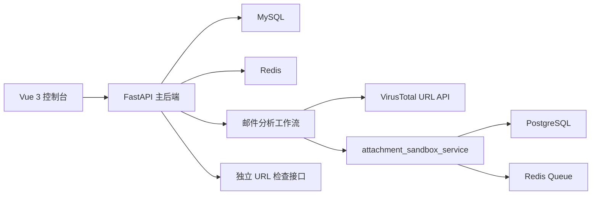
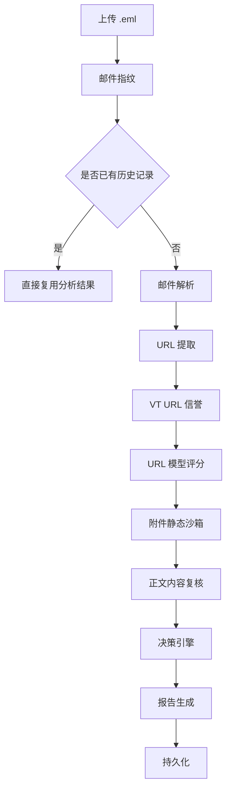

# 02. 系统架构与工作流

## 1. 总体架构

## 2. 分层说明

### 2.1 前端层

前端是统一控制台，核心页面位于 `frontend/src/views/`：

1. 邮件上传页
2. URL 风险页
3. 历史记录页
4. 静态沙箱页
5. 静态规则页

### 2.2 主后端层

主后端位于 `backend/`，职责如下：

1. 提供认证、分析、历史、报告和 URL 检查接口。
2. 负责邮件工作流编排。
3. 负责 URL 结果、邮件结果和 VT 缓存持久化。

### 2.3 附件静态沙箱层

独立目录 `attachment_sandbox_service/` 提供：

1. 附件样本入队
2. 静态规则命中
3. 风险分与裁决生成
4. 规则管理
5. 样本历史查询

## 3. 邮件分析工作流

当前邮件工作流定义在 `backend/workflow/graph.py`，顺序如下：

1. `fingerprint_email`
2. `check_existing_analysis`
3. `email_parser`
4. `url_extractor`
5. `url_reputation_vt`
6. `url_model_analysis`
7. `attachment_sandbox`
8. `content_review`
9. `decision_engine`
10. `report_renderer`
11. `persist_analysis`

## 4. URL 分析工作流

独立 URL 风险分析不会走邮件解析，直接进入 URL 级别链路：

1. URL 归一化
2. 查询 `url_analyses` 是否已有记录
3. 查询 VT URL 信誉
4. URL 模型评分
5. 轻量决策
6. 持久化或返回复用结果

## 5. 决策规则

核心决策位于 `backend/agent_tools/decision_engine.py`，重点规则如下：

1. 附件明确恶意时，直接判恶意。
2. VT URL 明确高危时，直接判恶意。
3. 正文存在强恶意证据时，可直接给出高风险结论。
4. 其他情况由 URL 模型、正文复核和附件结果综合判定。

## 6. 为什么这样设计

当前架构的好处是：

1. 工具职责清晰，便于替换和扩展。
2. URL 分析与邮件分析可复用同一套底层能力。
3. 静态沙箱独立部署，和主平台解耦。
4. 每一步都可输出结构化结果，方便论文展示和系统调试。
