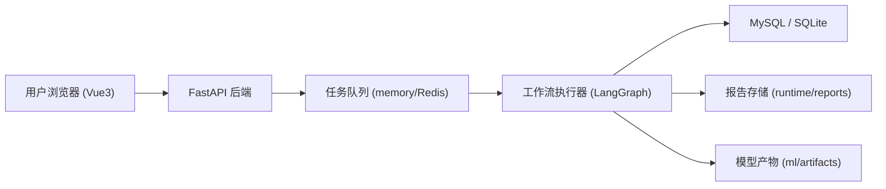

# 01. 系统架构与骨架

## 1. 组件级架构

## 2. 代码分层

### 2.1 前端层

1. 路由与登录守卫：`frontend/src/router.js`
2. 上传与任务轮询：`frontend/src/views/UploadView.vue`
3. 历史、反馈、报告：`frontend/src/views/HistoryView.vue`
4. 调参管理：`frontend/src/views/TuningView.vue`

### 2.2 后端接口层

1. 路由聚合：`backend/api/router.py`
2. 认证接口：`backend/api/routes/auth.py`
3. 分析与反馈接口：`backend/api/routes/analyses.py`
4. 任务状态接口：`backend/api/routes/jobs.py`
5. 报告下载接口：`backend/api/routes/reports.py`
6. 调参接口：`backend/api/routes/tuning.py`

### 2.3 服务与工作流层

1. 任务执行器：`backend/services/job_runner.py`
2. 业务服务：`backend/services/analysis_service.py`
3. 工作流图构建：`backend/workflow/graph.py`
4. 节点路由策略：`backend/workflow/edges.py`
5. 节点实现：`backend/workflow/nodes/*.py`

### 2.4 数据访问层

1. ORM 实体：`backend/models/tables.py`
2. 仓储层：`backend/repositories/*.py`
3. 迁移：`backend/alembic/*`

## 3. 启动与依赖装配流程

`backend/main.py` 在启动时执行以下关键动作：

1. 加载 `.env` 与配置对象。
2. 初始化数据库引擎与 SessionFactory。
3. 创建并注入 `AnalysisService`、`JobRunner`、`ReportStore`。
4. 注册全局异常处理与 CORS。
5. 在应用生命周期中启动/停止任务执行线程。

## 4. 数据库与队列后端选择机制

### 4.1 数据库选择

1. 若设置 `DATABASE_URL`，使用该连接（生产建议 MySQL）。
2. 若未设置 `DATABASE_URL`，回退 `SQLITE_DB_PATH`（开发兼容）。

### 4.2 队列选择

1. `JOB_QUEUE_BACKEND=redis` 时使用 Redis 队列。
2. `JOB_QUEUE_BACKEND=memory` 时使用进程内队列。

## 5. 为什么生产建议 MySQL + Redis

1. MySQL 更适合多用户并发、持久化与运维治理。
2. Redis 队列可减少应用重启导致的任务状态丢失风险。
3. 与调参版本管理和反馈审计场景更匹配。

