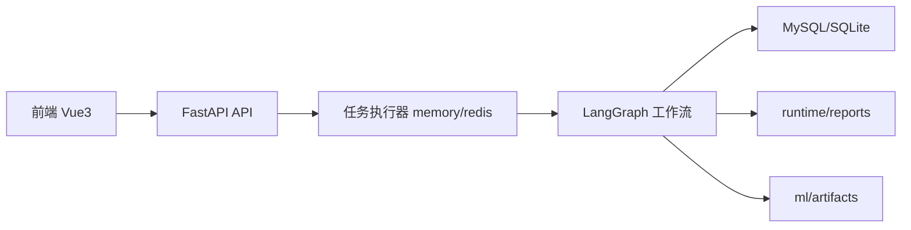

# 01. 系统架构

## 1. 组件图

## 2. 分层结构

### 2.1 前端

1. 上传页：发起分析任务并轮询任务状态。
2. 历史页：查列表、看详情、下载报告、打标、删记录。
3. 调参页：Precheck -> Run -> Activate。
4. 总览页：看统计和后端连接信息（密码脱敏）。

### 2.2 后端 API

1. 认证：`/auth/login`
2. 分析：`/analyses`、`/jobs`
3. 报告：`/reports/{analysis_id}`
4. 调参：`/tuning/fusion/*`
5. 系统信息：`/system/runtime-info`

### 2.3 工作流与服务

1. `AnalysisService` 负责任务生命周期和进度事件。
2. `JobRunner` 负责消费队列（memory 或 redis）。
3. LangGraph 节点负责解析、预测、融合、报告、持久化。

### 2.4 数据层

1. SQLAlchemy ORM 管表。
2. Alembic 管迁移。
3. `report_store` 管报告落盘。

## 3. 配置与后端切换

1. 数据库：
   - 有 `DATABASE_URL` 就按该地址连接。
   - 为空时回退 `sqlite:///runtime/db/analysis.db`。
2. 队列：
   - `JOB_QUEUE_BACKEND=redis` 用 Redis。
   - `JOB_QUEUE_BACKEND=memory` 用进程内队列。

## 4. 一个真实请求怎么走

以“上传邮件”为例：

1. `POST /analyses` 收到 `.eml`。
2. 创建 `analysis_jobs` 记录并入队。
3. Worker 消费任务并执行工作流。
4. 结果写入 `email_analyses`，报告写到 `runtime/reports`。
5. 前端轮询 `GET /jobs/{job_id}` 直到 `succeeded/cached/failed`。
