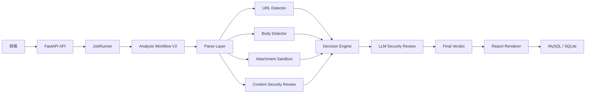

# 06. 架构重设计（V2）

> 归档说明：这是历史重构草案，保留用于回顾设计演进。当前实现以 URL-only 模型 + VT URL 信誉 + LLM 内容复核 + 附件静态沙箱为准。

## 1. 为什么要重设计

当前架构的问题，不是“模型不够多”，而是**职责混在一起**：

1. URL 风险、正文语义、HTML/脚本 payload、LLM 报告，都被塞进一条线性流程。
2. `analysis.py` 同时承担了“信号融合”“最终裁决”“规则优先级”三种职责。
3. LLM 现在主要用于提取 URL 和写报告，不是真正的安全复核器。
4. 新增规则层时，容易和 URL/正文模型职责重叠，导致系统越来越难解释。

V2 的目标不是“再加一个节点”，而是把职责重新拆清楚。

## 2. V2 设计原则

### 2.1 每层只做一件事

1. 解析层：只负责取数据。
2. 专家层：每个检测器只负责自己的领域。
3. 复核层：只做跨信号语义判断。
4. 决策层：只负责裁决，不负责检测。
5. 报告层：只负责呈现，不参与安全判断。

### 2.2 不混层

1. URL 是否恶意，只交给 URL 检测器。
2. 正文是否像钓鱼，只交给正文检测器。
3. HTML/XSS/脚本风险，只交给内容安全检测器或 LLM 复核。
4. 最终判定不再直接依赖“某个节点顺手给出的 reason”。

### 2.3 LLM 不再只是写报告

LLM 在 V2 中的角色应该从“报告生成器”改成“安全复核器”，报告生成只是次要产出。

## 3. V2 总体架构

## 4. 新的职责划分

## 4.1 Parse Layer

输入：`.eml`

输出：

1. `subject`
2. `plain_body`
3. `html_body`
4. `urls`
5. `attachments`
6. `headers`
7. `metadata`

要求：

1. 不做安全判断。
2. 不在这层引入“可疑/恶意”概念。
3. 只是把原始信号拆干净。

## 4.2 URL Detector

职责：

1. 只判断 URL 风险。
2. 只看域名、路径、参数、结构、URL 模型输出。

不负责：

1. 正文社工语义。
2. HTML payload。
3. 主题脚本片段。

输出建议：

1. `url_score`
2. `url_level`
3. `url_evidence`
4. `url_summary`

## 4.3 Body Detector

职责：

1. 只判断正文是否像钓鱼/社工。
2. 只关注语义、措辞、诱导、品牌仿冒、紧迫感。

不负责：

1. HTML 结构安全。
2. XSS / 脚本执行风险。
3. URL 恶意结构。

输出建议：

1. `body_score`
2. `body_level`
3. `body_evidence`
4. `body_summary`

## 4.4 Attachment Sandbox

职责：

1. 继续沿用外部沙箱与信誉判断。
2. 只负责附件。

输出建议：

1. `attachment_score`
2. `attachment_level`
3. `attachment_evidence`
4. `attachment_summary`

## 4.5 Content Security Review

这是 V2 里替代“越做越厚的 payload_guard”的层。

职责：

1. 看主题、纯文本正文、HTML 正文。
2. 判断是否存在 HTML/XSS/脚本/伪登录页/危险表单/主动跳转等内容安全风险。

实现建议：

1. 主体用 LLM。
2. 允许保留极少量硬拦截，只处理不能争议的高危语法，例如：
   - `<script`
   - `javascript:`
   - `onerror=`
   - `data:text/html`
3. 不把它做成通用大规则引擎。

输出建议：

1. `content_security_score`
2. `content_security_level`
3. `content_attack_types`
4. `content_security_evidence`
5. `content_security_summary`

## 4.6 LLM Security Review

这是新的核心复核层，不再等同于“报告生成”。

输入：

1. `subject`
2. `plain_body`
3. `html_body` 摘要
4. URL detector 结果
5. Body detector 结果
6. Attachment sandbox 结果
7. Content security review 结果
8. 初步裁决结果

输出固定 JSON：

1. `llm_verdict`
2. `llm_score`
3. `llm_confidence`
4. `llm_attack_types`
5. `llm_key_reasons`
6. `llm_action_recommendation`
7. `llm_override_recommended`

职责：

1. 补足跨层语义判断。
2. 判断“这是不是攻击意图”。
3. 处理规则和模型冲突场景。

不负责：

1. 直接代替 URL/正文模型。
2. 代替附件沙箱。
3. 生成最终展示 Markdown。

## 4.7 Decision Engine

V2 中最重要的变化：**不再用一个简单融合函数处理所有事情。**

改成分阶段裁决：

### 阶段 A：强信号优先

1. 附件为恶意 -> 直接恶意。
2. 内容安全层判定为高危主动内容 -> 直接高风险。

### 阶段 B：单域裁决

1. URL 高风险，但正文低风险 -> 判为“链接风险主导”。
2. 正文高风险，但 URL 低风险 -> 判为“社工风险主导”。

### 阶段 C：边界样本复核

满足下面任意条件时，调用 `LLM Security Review`：

1. URL 与正文结论冲突。
2. 分数接近阈值。
3. 存在 HTML 内容。
4. 存在内容安全可疑项但不够强。

### 阶段 D：最终裁决

综合：

1. `attachment_score`
2. `url_score`
3. `body_score`
4. `content_security_score`
5. `llm_score`

但这里不再叫“融合权重”，而是叫**决策策略**。

## 5. 为什么不再强调“融合权重”

因为当前项目的核心问题不是“0.4 和 0.6 谁更好”，而是：

1. 不同类型的风险根本不该强行混成一个连续分数。
2. HTML/XSS 风险和 URL 仿冒风险不是同一维度。
3. 附件恶意通常应该具有更高优先级。

所以 V2 更适合：

1. 先分域判定。
2. 再按优先级进入最终裁决。
3. 只在相近域中使用数值融合。

## 6. 报告层怎么改

报告层不再直接消费“机器学习 + 附件 + final_decision”这几项，而是消费新的结构化结果：

1. `url_summary`
2. `body_summary`
3. `attachment_summary`
4. `content_security_summary`
5. `llm_key_reasons`
6. `final_verdict`

报告层只负责模板化输出，不再负责兜底安全判断。

## 7. 数据模型建议

建议在 `email_analyses` 中增加或拆分：

1. `content_security_analysis`
2. `llm_security_review`
3. `decision_trace`

保留：

1. `url_analysis`
2. `body_analysis`
3. `attachment_analysis`
4. `final_decision`

不建议继续把更多信息塞进 `final_decision.reason`。

## 8. 工作流建议

V2 推荐链路：

1. `fingerprint_email`
2. `check_existing_analysis`
3. `parse_eml_file`
4. `extract_urls`
5. `analyze_attachment_reputation`
6. `analyze_url_reputation`
7. `content_security_review`
8. `preliminary_decision`
9. `llm_security_review`
10. `final_decision`
11. `render_report`
12. `persist_analysis`

## 9. 对当前代码的处理建议

### 9.1 应删除或弱化

1. 厚规则化的 `payload_guard`
2. 让 LLM 只做报告的定位
3. 过度依赖 `fusion_threshold` 的最终判定方式

### 9.2 应保留

1. URL 模型层
2. 正文模型层
3. 附件沙箱层
4. 队列/API/持久化基础设施

### 9.3 应新增

1. `content_security_review`
2. `llm_security_review`
3. `decision_engine_v2`

## 10. 推荐迁移顺序

不要一次性重写全链路，按下面顺序迁移：

1. 先把 LLM 从“报告生成”改成“结构化安全复核”。
2. 新增 `content_security_review`，替代现有厚规则 payload 方案。
3. 把 `analysis.py` 拆成：
   - `preliminary_decision`
   - `final_decision`
4. 报告层改成消费结构化安全结果，而不是自己拼装大量兜底语义。
5. 最后再清理旧的融合逻辑和冗余字段。

## 11. 一句话结论

V2 的核心不是“再加节点”，而是：

**让 URL、正文、附件、内容安全、LLM 复核各回各位，最后由独立决策引擎统一裁决。**
