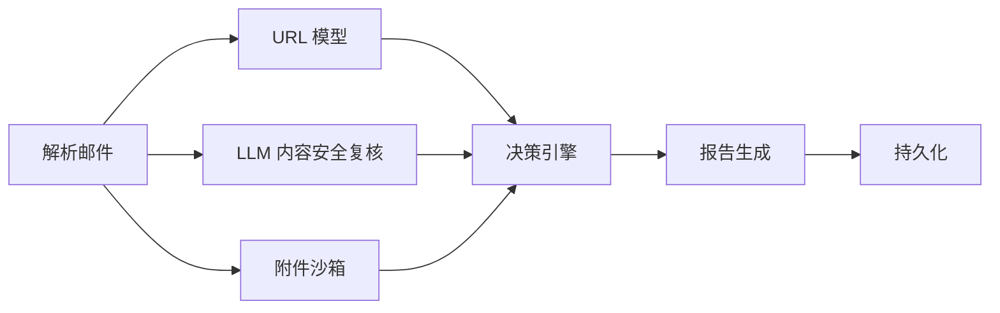

# 07. LLM First 架构改造计划

> 归档说明：这是历史计划文档，不代表当前线上实现。当前仓库已经移除正文模型，只保留 URL 模型与 LLM 内容复核链路。

## 1. 目标

把当前邮件分析链路改造成职责清晰的四层结构：

1. URL 风险：继续使用机器学习模型。
2. 正文 + 主题 + HTML 内容风险：改为 LLM 结构化复核。
3. 附件风险：继续使用外部沙箱。
4. 最终报告：单独生成，不再让“安全判断”和“报告输出”混在一个节点里。

## 2. 最终目标架构



## 3. 分层职责

### 3.1 解析层

职责：

1. 解析 `.eml`
2. 提取 `subject`
3. 提取 `plain_body`
4. 提取 `html_body`
5. 提取 `urls`
6. 提取 `attachments`

要求：

1. 不做风险判断
2. 只提供干净输入

### 3.2 URL 风险层

职责：

1. 只判断 URL 是否像恶意链接

输入：

1. `urls`

输出：

1. `url_score`
2. `url_level`
3. `url_evidence`
4. `url_summary`

说明：

1. 不混入正文语义判断
2. 不混入 payload/XSS 规则判断

### 3.3 LLM 内容安全复核层

职责：

1. 判断主题、正文、HTML 是否存在钓鱼、社工、伪装、XSS/脚本、伪登录页等风险

输入：

1. `subject`
2. `plain_body`
3. `html_body`
4. URL 分析结果摘要
5. 附件沙箱结果摘要

输出固定 JSON：

```json
{
  "verdict": "malicious|suspicious|benign",
  "score": 0.0,
  "confidence": 0.0,
  "attack_types": [],
  "reasons": [],
  "evidence": [],
  "recommended_action": ""
}
```

说明：

1. 这是安全判断节点，不是报告生成节点
2. 必须输出稳定 JSON，供后端使用

### 3.4 附件风险层

职责：

1. 继续使用外部沙箱/信誉接口

输入：

1. `attachments`

输出：

1. `attachment_score`
2. `attachment_level`
3. `attachment_evidence`
4. `attachment_summary`

### 3.5 决策层

职责：

1. 汇总 URL 模型结果
2. 汇总 LLM 内容安全复核结果
3. 汇总附件沙箱结果
4. 输出最终判定

输入：

1. `url_analysis`
2. `llm_content_review`
3. `attachment_analysis`

输出：

```json
{
  "is_malicious": true,
  "score": 0.0,
  "reason": "",
  "decision_trace": []
}
```

### 3.6 报告层

职责：

1. 根据结构化结果生成 Markdown 报告

输入：

1. `url_analysis`
2. `llm_content_review`
3. `attachment_analysis`
4. `final_decision`

说明：

1. 不再承担安全判断职责
2. 可使用 LLM 辅助润色，也可以用模板生成

## 4. 当前系统中应保留的部分

保留：

1. URL 模型及其训练产物
2. 附件沙箱能力
3. 队列、任务系统、持久化、前后端 API 结构
4. 邮件解析、历史记录、报告下载、人工反馈能力

## 5. 当前系统中应替换的部分

替换：

1. 正文机器学习模型主判定职责
2. 当前把 LLM 主要用于“写报告”的角色定位
3. 过于依赖简单融合函数的最终裁决方式

## 6. 当前系统中应删除或降级的部分

降级为可选或 fallback：

1. 正文机器学习模型

删除或不继续扩展：

1. 厚规则式 `payload_guard`
2. 把 XSS/payload 判定混到 URL 层的做法

## 7. 新工作流建议

推荐的新节点顺序：

1. `fingerprint_email`
2. `check_existing_analysis`
3. `parse_eml_file`
4. `extract_urls`
5. `analyze_attachment_reputation`
6. `analyze_url_reputation`
7. `llm_content_review`
8. `decision_engine_v2`
9. `render_report`
10. `persist_analysis`

## 8. 决策逻辑建议

### 8.1 高优先级规则

1. 附件沙箱明确恶意 -> 直接恶意
2. LLM 内容复核明确高危且置信度高 -> 高优先级恶意

### 8.2 一般情况

1. URL 风险高 + LLM 内容风险高 -> 恶意
2. URL 风险低 + LLM 内容风险高 -> 恶意或可疑
3. URL 风险高 + LLM 内容风险低 -> 可疑或恶意
4. URL 风险低 + LLM 内容风险低 + 附件安全 -> 正常

### 8.3 输出要求

最终判定应包含：

1. 主要风险来源
2. 分数
3. 判定原因
4. 决策轨迹

## 9. LLM Prompt 设计原则

### 9.1 内容复核 Prompt

要求：

1. 面向安全判断
2. 输出固定 JSON
3. 不输出 Markdown
4. 不输出自由发挥的大段话
5. 明确要求判断：
   - 社工诱导
   - 账号钓鱼
   - 财务欺诈
   - XSS/脚本风险
   - 伪登录页
   - HTML 主动内容

### 9.2 报告生成 Prompt

要求：

1. 只做报告润色和整理
2. 不重新裁决安全结论

## 10. 数据结构调整建议

建议新增：

1. `llm_content_review`
2. `decision_trace`

建议保留：

1. `url_analysis`
2. `attachment_analysis`
3. `final_decision`
4. `llm_report`

## 11. 改造阶段

### Phase 1

目标：

1. 引入 `llm_content_review`
2. 保持现有 URL 模型和附件沙箱不动
3. 正文模型先保留，但降级为 fallback，不作为主判定

### Phase 2

目标：

1. 新增 `decision_engine_v2`
2. 让最终裁决基于 URL + LLM + 附件

### Phase 3

目标：

1. 拆分 `llm_report`
2. 把“安全判断”和“报告输出”分离

### Phase 4

目标：

1. 清理旧的正文模型主流程
2. 删除不再需要的旧融合逻辑

## 12. 风险与注意事项

1. LLM 输出必须强制 JSON 化，否则后端难以稳定消费
2. LLM 需要设置超时、失败回退和异常兜底
3. 正文机器学习模型在 Phase 1 可以保留为 fallback，避免一次性切换风险过大
4. 最终报告不应反向影响安全判定

## 13. 实施顺序建议

建议按下面顺序开始实现：

1. 先实现 `llm_content_review`
2. 再实现 `decision_engine_v2`
3. 再拆 `llm_report`
4. 最后清理正文模型主链路

## 14. 一句话结论

新的合理架构应该是：

**URL 交给机器学习，正文/主题/HTML 交给 LLM 安全复核，附件交给沙箱，最后再单独输出报告。**
