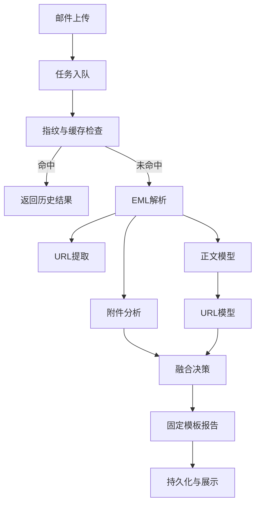

# PEA Agent 毕设论文启动文档（面向 AI Agent）

## 0. 文档用途
本文件用于让 AI Agent 在最短上下文内生成“可提交的论文初稿”。
写作目标是：聚焦技术实现、工程可复现性、实验可验证性，避免空泛描述。

主技术资料入口（建议先读）：
- `docs/project_handbook.md`
- `docs/handbook/`

## 1. 结构化元信息（供 AI 快速读取）
```json
{
  "project_name": "PEA Agent",
  "project_type": "面向企业邮件场景的钓鱼邮件检测与分析系统",
  "core_stack": {
    "frontend": ["Vue3", "Vite"],
    "backend": ["FastAPI", "SQLAlchemy", "Alembic"],
    "workflow": ["LangGraph"],
    "models": ["URL信誉模型", "正文信誉模型", "融合决策"],
    "storage": ["MySQL(当前主用)", "SQLite(兼容)", "Redis队列(可选)"],
    "reporting": ["固定模板中文报告", "Markdown渲染与兜底"]
  },
  "problem_statement": "传统规则或单模型在复杂邮件场景中误报与漏报并存，且缺乏可解释和可运营的闭环。",
  "solution_summary": "通过多节点分析工作流、融合评分、人工反馈调参与版本激活机制，实现可解释、可运维、可持续优化的邮件威胁分析平台。",
  "deployment_characteristics": [
    "异步任务执行",
    "报告与历史可追溯",
    "人工反馈可审计",
    "参数版本可激活回滚",
    "支持MySQL+Redis生产化部署"
  ]
}
```

## 2. 可直接用的论文题目候选
1. 基于多阶段工作流与反馈闭环的企业钓鱼邮件检测系统设计与实现
2. 面向邮件安全运营的融合决策与人工反馈调优方法研究
3. 一种可解释、可迭代的钓鱼邮件智能分析平台：从模型到工程落地

## 3. 摘要草稿（可直接扩写）
本文面向企业邮件安全场景，设计并实现了一套集“自动检测、解释报告、人工反馈、参数优化”于一体的钓鱼邮件分析系统 PEA Agent。系统以后端分析工作流为核心，将邮件解析、URL 信誉分析、正文语义风险分析、附件威胁检测和融合决策进行分阶段编排，结合异步任务机制提升处理稳定性与可扩展性。在工程实现上，系统采用 FastAPI + SQLAlchemy + Alembic 构建后端服务，Vue3 构建前端交互界面，支持 MySQL 与 Redis 的生产化部署；在模型策略上，采用“正文概率 + URL 概率”的动态加权融合，并引入人工反馈驱动的调参与版本激活机制，形成可持续优化闭环。为提升报告一致性，系统将模型输出与规则证据映射到固定中文模板，降低生成内容漂移。实验与运行结果表明，该系统在可解释性、可运维性和业务适配性方面优于仅依赖单模型或静态规则的方案，具备较好的实际应用价值。

关键词：钓鱼邮件检测；融合决策；工作流编排；人工反馈；安全运营

## 4. 技术要点（论文主体重点）

### 4.1 多阶段分析工作流（核心架构）
- 采用状态图编排邮件分析流程：指纹去重、解析、URL提取、正文模型、URL模型、附件检测、融合决策、报告生成、结果持久化。
- 价值：将复杂检测逻辑拆分为可观测、可替换、可扩展节点，便于定位误判来源。



### 4.2 融合决策方法（算法贡献点）
- 基础输入：
  - `p_text`: 正文钓鱼概率
  - `p_url`: URL钓鱼概率（可取最大风险URL）
- 动态置信加权思想：根据概率远离 0.5 的程度动态调整权重，降低低置信信号的影响。
- 融合评分用于最终恶意判定阈值比较。

可在论文中写为：
\[
score = w_u' \cdot p_{url} + w_t' \cdot p_{text}
\]
其中 \(w_u'\)、\(w_t'\) 为置信修正后的归一化权重。

### 4.3 人工反馈闭环与参数版本管理（工程创新点）
- 支持分析结果人工标注（恶意/正常）与备注，保留反馈变更历史。
- 调参流程必须人工触发，包含样本门槛预检查，避免小样本自动漂移。
- 调参结果以“版本”管理，只有显式激活才生效，确保线上可控。

### 4.4 生产化后端设计
- 数据层：已支持 MySQL（当前迁移主库）和 SQLite（兼容）。
- 队列层：支持内存队列与 Redis 队列，适配开发与部署环境。
- 数据迁移：Alembic 管理版本，保证 schema 可演进。
- 安全：JWT 鉴权、登录限流、错误信息脱敏返回。

### 4.5 报告生成与解释稳定性
- 报告采用固定中文模板，章节结构稳定。
- LLM 仅补充结构化字段，失败时自动回退默认中文文本。
- 前端 Markdown 渲染加入异常兜底，避免格式异常导致页面不可读。

### 4.6 可观测与可追溯
- 任务阶段进度可查询，支持从“上传→分析→报告”全链路追踪。
- 历史记录支持筛选、删除、清空，并保留人工反馈审计信息。

## 5. 论文“问题-方案-结果”写作骨架

### 5.1 问题定义
- P1：单点检测难以覆盖多模态攻击信号（正文、URL、附件）。
- P2：模型结果缺乏可解释输出，不利于人工复核。
- P3：线上策略难以随业务变化持续优化，缺乏反馈闭环。

### 5.2 方法设计
- M1：状态图驱动的多节点分析流程。
- M2：基于双模型分数的动态融合决策。
- M3：人工反馈驱动的参数调优与版本激活机制。
- M4：固定模板中文报告机制，提升可读性与一致性。

### 5.3 结果指标（建议）
- 检测效果：Precision、Recall、F1、FPR。
- 工程指标：平均处理时延、任务成功率、报告可用率。
- 运营指标：人工复核效率、反馈采纳率、参数版本迭代频次。

## 6. 实验设计建议（可直接写成“实验章”）

### 6.1 数据集划分
- 训练/验证/测试按时间切分，避免信息泄露。
- 加入真实业务样本与公开样本混合评估。

### 6.2 对比实验
1. 仅正文模型。
2. 仅URL模型。
3. 固定权重融合。
4. 动态置信融合（本方案）。
5. 有/无人工反馈调参对比。

### 6.3 消融实验
- 去掉附件检测，观察误判变化。
- 去掉置信修正，仅线性加权。
- 去掉反馈门槛约束，观察参数稳定性。

### 6.4 可解释性评估
- 报告一致性：章节完整率、空字段率。
- 人工评审打分：可读性、可执行性、可信度。

## 7. 创新点与贡献（建议写法）
1. 提出面向邮件安全运营的“检测-解释-反馈-调优”闭环式系统架构。
2. 将动态置信加权融合策略与工程化版本激活机制结合，兼顾效果与上线可控性。
3. 构建固定模板中文报告机制，降低 LLM 输出漂移对业务使用的影响。
4. 在真实工程中实现 MySQL + Redis 部署与全链路可追溯能力。

## 8. 局限性与后续工作（建议保留）
- 目前正文与URL模型特征仍可进一步升级（如更强表征模型）。
- 附件检测依赖外部情报接口，存在时效与可用性影响。
- 反馈样本质量对调参效果敏感，需引入更严格的数据治理策略。
- 后续可引入在线学习与主动学习机制，提高低频攻击识别能力。

## 9. AI Agent 写作指令模板（可直接复制）

### 9.1 生成“第1章 绪论”
请基于《PEA Agent 毕设论文启动文档》，撰写“第1章 绪论”，要求包含：研究背景、研究意义、国内外现状综述、本文工作与贡献、章节安排。语言为中文学术文风，约 2500-3500 字。

### 9.2 生成“第3章 系统设计”
请基于该项目的多阶段工作流、融合决策、反馈闭环与生产化部署细节，撰写“第3章 系统设计”，要求包含架构图说明、模块职责、关键数据流、接口与数据表设计，约 3000-4500 字。

### 9.3 生成“第4章 实现与实验”
请输出“第4章 实现与实验”，需包括实现环境、关键实现细节、实验指标、对比实验、消融实验、结果分析与讨论。若缺少具体数值，请先给出实验表格模板并标注“待填”。

## 10. 参考文献占位建议
- 可先采用“[R1]~[R20]”占位，后续由你补真实文献。
- 至少覆盖：钓鱼邮件检测、文本分类、URL检测、模型融合、主动学习/反馈学习、邮件安全工程化。

## 11. 交付建议
- 先让 AI 按第1/3/4章生成初稿。
- 再由你补充“真实实验数值+图表”。
- 最后统一术语与格式（学校模板、参考文献格式、图表编号）。
